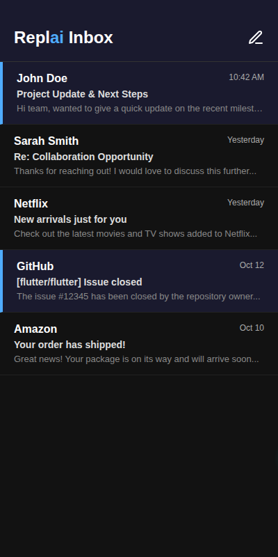
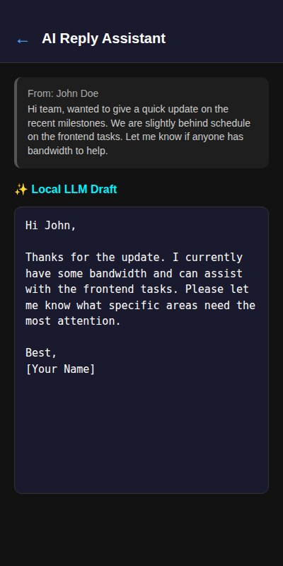

# Replai - On-Device AI Email Assistant 📧🤖

**Replai** is a privacy-first, completely on-device AI email reply assistant built with Flutter. It connects directly to your email provider via IMAP and SMTP, utilizing a local Large Language Model (LLM) to generate smart, context-aware email replies. Your personal data never leaves your device.

## ✨ Features

- **On-Device AI Intelligence**: Uses `llama_flutter_android` to run powerful LLMs completely locally on your device.
- **Direct Email Connection**: Securely connects to your existing email server using `enough_mail` (IMAP) and `mailer` (SMTP).
- **Privacy First**: No cloud APIs, no data collection. Your emails and generated replies stay strictly on your device.
- **Modern, Sleek UI**: Built with a beautiful dark-mode first design using Flutter.
- **Robust Architecture**: Scalable state management powered by `flutter_riverpod` and routing via `go_router`.
- **Secure Storage**: Your email credentials are kept safe using `flutter_secure_storage` and `hive`.

## 📱 Screenshots

| Inbox View | AI Reply Generation |
|:---:|:---:|
|  |  |

## 🛠️ Tech Stack

- **Framework**: [Flutter](https://flutter.dev/) (SDK ^3.6.0)
- **State Management**: `flutter_riverpod`
- **Navigation**: `go_router`
- **AI Engine**: `llama_flutter_android`
- **Email Protocols**: `enough_mail`, `mailer`
- **Local Storage**: `hive`, `flutter_secure_storage`
- **UI Components**: `webview_flutter`, `flutter_widget_from_html`

## 🚀 Getting Started

1. **Clone the repository:**
   ```bash
   git clone https://github.com/yourusername/replai.git
   cd replai
   ```

2. **Install dependencies:**
   ```bash
   flutter pub get
   ```

3. **Run the app:**
   ```bash
   flutter run
   ```

*(Note: Depending on the local LLM model you choose, the initial run might require downloading the model weights to the device's local storage.)*

## 🤝 Contributing

Contributions, issues, and feature requests are welcome! Feel free to check the [issues page](https://github.com/yourusername/replai/issues).

## 📄 License

This project is licensed under the MIT License.
